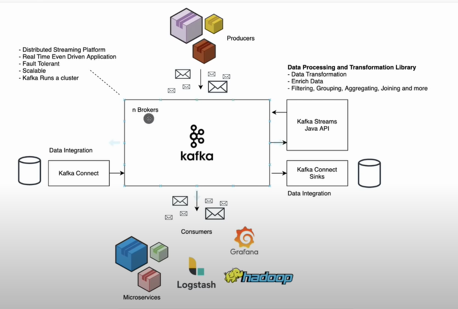
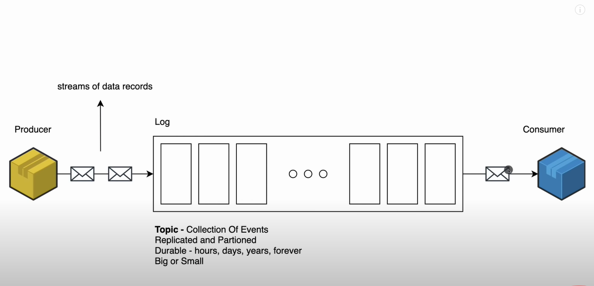

Downnload Kafka from [here](https://kafka.apache.org/quickstart) and unzip it to a folder, for example `kafka` folder.

cd to the directory. `C:\kafka>`

### Start Zookeeper
```bash
.\bin\windows\zookeeper-server-start.bat .\config\zookeeper.properties
```

### Start Kafka
```bash
.\bin\windows\kafka-server-start.bat .\config\server.properties
```

### REST API to send messages 
```
curl --location --request POST 'http://localhost:8080/kafka' \
--header 'Content-Type: application/json' \
--data-raw '{
  "key": "key 1",
  "message": "hi there!!!!!!!!!!!!!"
}'
```




---

## Some useful commands for Windows

In the `C:\kafka>` directory

### Create a topic (`topic1`)
```bash
.\bin\windows\kafka-topics.bat --create --zookeeper localhost:2181 --replication-factor 1 --partitions 1 --topic topic1
```
### List all topics
```bash
.\bin\windows\kafka-topics.bat --list --zookeeper localhost:2181
```

### Start a producer
```bash
.\bin\windows\kafka-console-producer.bat --broker-list localhost:9092 --topic topic1
```
then you can type some messages and press enter to send them.

### Start a consumer
```bash
.\bin\windows\kafka-console-consumer.bat --bootstrap-server localhost:9092 --topic topic1 --from-beginning
```
then you can see the messages you typed in the producer.

